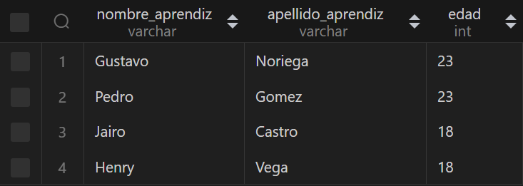

# BASE DE DATOS `SENA`

## MODELO E-R

## MODELO RELACIONAL

### `PUNTOS A RESOLVER:`

**1. Agregue un campo Estado_Matrícula a la tabla Matrícula que indique si el estudiante se encuentra “En Ejecución”, “Terminado” o “Cancelado”**

~~~sql
ALTER TABLE matriculas 
ADD COLUMN estado_matricula VARCHAR(100); 
~~~

**2. Agregue a el campo edad a la tabla de Aprendices.**

~~~sql
ALTER TABLE aprendiz ADD COLUMN edad INT;
~~~

**3. Si suponemos que los cursos tienen una duración diferente dependiendo de la ruta que lo contenga ¿qué modificación haría a la estructura de datos ya planteada?**

~~~sql
-- Dado que, el atributo pertenece a la relacion entre ruta y curso se agrega a la tabla que las une.

ALTER TABLE cursos_ruta ADD COLUMN duracion TIME;
~~~

**4. Seleccionar los nombres y edades de aprendices que están cursando la carrera de electrónica.**

~~~sql
SELECT nombre_aprendiz , apellido_aprendiz, edad
FROM aprendiz
WHERE id_carrera = 2;
~~~

***DATOS DE CONSULTA***:

>   

**5. Seleccionar Nombres de Aprendices junto al nombre de la ruta de aprendizaje que cancelaron.**

~~~sql
SELECT a.nombre_aprendiz, a.apellido_aprendiz, r.nombre_ruta 
FROM matriculas
INNER JOIN aprendiz a ON a.id_aprendiz = matriculas.id_aprendiz
INNER JOIN rutas r ON r.id_ruta = matriculas.id_ruta 
WHERE estado_matricula = 'Cancelado';
~~~

***DATOS DE CONSULTA***:

>   

**6. Seleccionar Nombre de los cursos que no tienen un instructor asignado.**

~~~sql
SELECT nombre_curso 
FROM cursos 
WHERE id_curso NOT IN (SELECT id_curso FROM cursos_instructor);
~~~

***DATOS DE CONSULTA***:

> 

**7. Seleccionar Nombres de los instructores que dictan cursos en la ruta de aprendizaje “Sistemas de Información Empresariales”.**

~~~sql
SELECT DISTINCT i.nombre_instructor, i.apellido_instructor
FROM instructores i 
INNER JOIN cursos_instructor ci ON ci.id_instructor = i.id_instructor
INNER JOIN cursos c ON c.id_curso = ci.id_curso
INNER JOIN cursos_ruta cr ON cr.id_curso = c.id_curso
WHERE cr.id_ruta = 1;
~~~

***DATOS DE CONSULTA***:

>   

**8. Genere un listado de todos los aprendices que terminaron una Carrera mostrando el nombre del profesional, el nombre de la carrera y el énfasis de la carrera (Nombre de la Ruta de aprendizaje)**

~~~sql
SELECT a.nombre_aprendiz, a.apellido_aprendiz, c.nombre_carrera,r.nombre_ruta FROM matriculas
INNER JOIN aprendiz a ON a.id_aprendiz = matriculas.id_aprendiz
INNER JOIN rutas r ON r.id_ruta = matriculas.id_ruta 
INNER JOIN carreras c ON c.id_carrera = a.id_carrera
WHERE matriculas.estado_matricula = 'Terminado';
~~~

***DATOS DE CONSULTA***:

>   

**9. Genere un listado de los aprendices matriculados en el curso “Bases de Datos Relacionales”.**

~~~sql
SELECT a.nombre_aprendiz, a.apellido_aprendiz 
FROM cursos_aprendiz ca 
INNER JOIN aprendiz a ON a.id_aprendiz = ca.id_aprendiz
WHERE ca.id_curso = 17;
~~~

***DATOS DE CONSULTA***:

>   

**10. Nombres de Instructores que no tienen curso asignado.**

~~~sql
SELECT nombre_instructor,apellido_instructor FROM instructores where id_instructor NOT IN (SELECT id_instructor from cursos_instructor);
~~~

***DATOS DE CONSULTA***:

>   

## Gracias por ver :3

